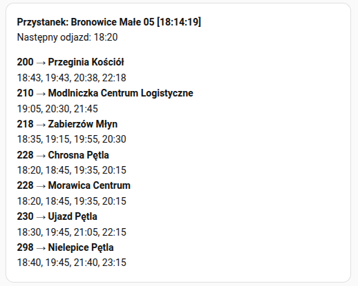
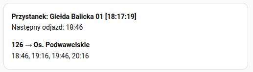

# Home Assistant custom component mMPK

MPK Kraków public transport timetable

## Sensor configuration
```yaml
sensor:
  - platform: mmpk
    stops:
      - id: 1
        description: Bronowice Małe
      - id: 2
        description: Giełda Balicka
        lines:
          - "126"

```

* A sensor configured with id: `1` will retrieve data for all available buses and trams at the specified stop.
* A sensor configured with id: `2` will retrieve data exclusively for line `126` at the specified stop.
* `description` is optional

## Stop list

[CSV](doc/MPK_stops.csv)

## Instalation
### Manual


### 📦 Manual Installation

To install this integration manually, you need to download [**mmpk.zip**](https://github.com/mysiar/ha-custom-component-mmpk/releases/latest/download/mmpk.zip) and extract its contents to the `config/custom_components/mmpk` directory.


```bash
mkdir -p custom_components/mmpk
cd custom_components/mmpk
wget https://github.com/mysiar/ha-custom-component-mmpk/releases/latest/download/mmpk.zip
unzip mmpk.zip
rm mmpk.zip
```

## Display data 

* Markdown card
```






_Sensor {{ sensor }} jest niedostępny lub wyłączony._

  
  
  
  

**Przystanek: {{ stop if stop else "Nieznany" }} [{{ updated[11:19] }}]**  
Następny odjazd: {{ next_departure }}  

  
    
**{{ line }} → {{ variant.direction }}**  

{{ variant.departures | join(', ') }}

    
  

Brak danych o odjazdach



```

**Sensor 1 card**



**Sensor 2 card**

